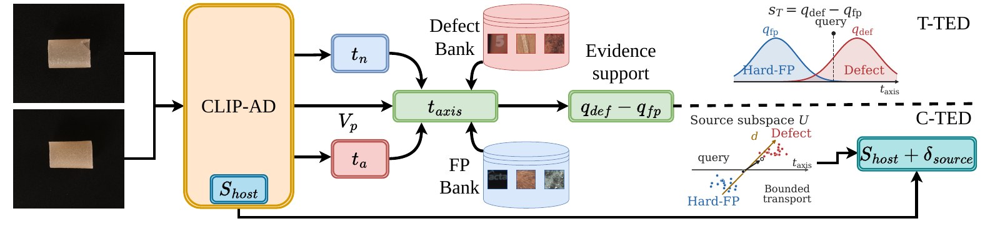
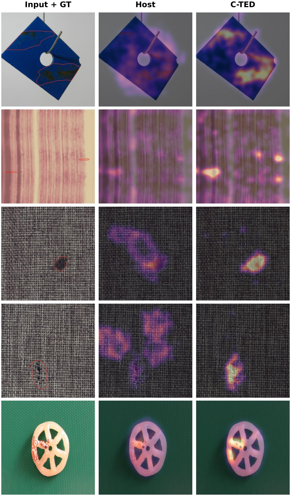

# TED: Text-Axis Evidence Decomposition for Prompted Anomaly Localization

<p align="center">
  <strong>NeurIPS 2026 · Main Track · Poster</strong><br>
  JinYoung Kim · Geonho Kim · GiJeong Park · Geonu Lee · Youngjoon Yoo<br>
  <sub>Corresponding author: Youngjoon Yoo</sub>
</p>

<p align="center">
  <a href="https://arxiv.org/abs/2609.39033">Paper</a> ·
  <a href="https://huggingface.co/KIMJINYOUNG/TED-reproducibility">Models & artifacts</a> ·
  <a href="#quick-start">Quick start</a> ·
  <a href="reproduction/README.md">Reproduction guide</a> ·
  <a href="docs/SERVICE.md">Docker service</a> ·
  <a href="docs/RELEASE_STATUS.md">Release status</a>
</p>

**TED** is a post-hoc local scoring method for prompted anomaly localization.
It contrasts source defect evidence with source hard false-positive evidence
along a frozen host's normal-to-anomaly text axis.

Research code, historical checkpoints, and source banks are available.
**Full-paper fresh reproduction and all-model deployment are in progress.**
The paper's reported results, archival verification, fresh GPU runs, and
service checks are identified separately below.

## Verified release

**Available now:** public research source/checkpoints/banks, execution recipes,
verified full-BTAD replays for the configurations listed below, and tested
FAPrompt/AA-CLIP inference paths. See the [release status](docs/RELEASE_STATUS.md)
for each component's scope and deployment limits.

Status: **October 9, 2026**. Counts describe the stated check, not successful
GPU reproduction of every configuration.

<details>
<summary>Expand verification records and exact scope</summary>

| Available component | Verified scope | Evidence / entry point |
|---|---|---|
| T-TED and C-TED cores | Numerical parity and synthetic tests; C-TED cores for AA-CLIP, AdaCLIP, FAPrompt | [T-TED](docs/TTED.md), [C-TED](docs/CTED.md) |
| Archived research source | 920 source files with SHA-256 verification | [Source and notices](reproduction/SOURCE-NOTICES.md) |
| Main/host execution recipes | 232 configurations: 207 adapted-host seed runs + 25 frozen-backbone runs | [Recipe guide](reproduction/README.md) |
| Public host checkpoints | 11 objects bound to the 207 adapted-host configurations | [Anonymous download check](reproduction/validation/2026-10-08/public-checkpoint-download-validation.json) |
| Public source banks | 92 adapted-host banks + 10 frozen-backbone banks | [Host-bank audit](reproduction/validation/huggingface-banks-public-verification.json), [raw-bank download](reproduction/validation/public-raw-bank-download-validation.json) |
| Upstream backbone acquisition | All 8 backbone files downloaded and matched to pinned size/SHA-256 | [Download evidence](reproduction/validation/public-backbone-download-validation.json) |
| Full dataset input checks | 23,091 referenced files across MVTec AD, VisA, MPDD, BTAD | [Dataset guide](reproduction/DATASETS.md), [byte verification](reproduction/validation/2026-10-08/public-dataset-validation.json) |
| ImageBind fresh GPU replay | Full BTAD; all 12 Base/T-TED/C-TED metrics match the archived reference at 2 decimals on RTX 6000 Ada | [Execution and comparison](reproduction/validation/2026-10-08/report.json) |
| AA-CLIP fresh A10 replay | Full BTAD, seed 0: main L/14-336 and source-limit-1 each match 8/8 metrics; main L/14-224 matches 7/8 and B+ matches 6/8, with all differences retained | [Results and summaries](reproduction/validation/a10-20261009/report.json) |
| FAPrompt fresh A10 main replay | Full BTAD, seed 0, L/14-336: all 8 Base/OURS metrics match the archived reference at 2 decimals | [Execution and summary](reproduction/validation/a10-20261009/faprompt-main/execution.json) |
| FAPrompt fresh A10 weak-source replay | Full BTAD, seed 0, bank budget 8: all 8 Base/OURS metrics match the archived reference at 2 decimals | [Execution and summary](reproduction/validation/a10-20261009/faprompt-weak-bank-8/execution.json) |
| AA-CLIP captured-state HTTP bridge | Three BTAD images, one per category; CPU HTTP raw maps match the original evaluator math exactly for the source-limit-1 ablation state | [HTTP evidence](reproduction/validation/a10-20261009/aa-http-parity.json), [worker guide](docs/SERVICE.md#aa-clip-captured-state-worker) |
| AA-CLIP relocated serving bundle | The same three images retain exact raw-map parity after relocation, with original-workspace reads and network connections prohibited | [Relocation evidence](reproduction/validation/a10-20261009/aa-relocation-parity.json) |
| AA-CLIP pilab Docker worker | Source-limit-1 state: three-image maps and raw scores exactly match same-pilab original equations over HTTP; cross-A10 differences retained | [Container parity](reproduction/validation/a10-20261009/aa-pilab-container-local-parity.json), [A10 difference](reproduction/validation/a10-20261009/aa-pilab-a10-difference.json) |
| AA-CLIP main pilab Docker worker | Main L/14-336 seed 0, input 518: three-image maps and raw scores exactly match same-pilab original equations over HTTP | [Main container parity](reproduction/validation/a10-20261009/aa-pilab-main-container-local-parity.json) |
| Three-model Docker selector | FAPrompt, AA main, and AA source-limit-1: nine direct-worker/gateway predictions match exactly; browser upload checked | [Gateway guide](docs/SERVICE.md#selecting-the-three-verified-pilab-workers), [Evidence](reproduction/validation/a10-20261009/model-gateway-parity.json) |
| Weak-source ablation inputs | 28 configurations / 12 public banks; anonymous acquisition verified; all 24 printed gain cells match archived-summary aggregation | [Download check](reproduction/validation/public-weak-bank-download-validation.json), [table check](reproduction/validation/weak-source-archived-table-validation.json) |
| FAPrompt Docker/API path | Three BTAD images: HTTP raw maps match CPU historical-equation inference exactly | [Service evidence](docs/SERVICE.md) |

</details>

**Still required:** all model/backbone/dataset/seed GPU reruns, unresolved
historical mean provenance, fresh source-bank rebuilding, the remaining
ablation/figure analyses, and all-model Docker adapters. MVTec AD 2 remains
required and currently needs readable source data. ImageBind on Blackwell and
AA-CLIP H/14 have documented mismatches; successful checks above do not erase
them. See [scope and remaining work](docs/REPRODUCIBILITY.md).

## Quick start

Choose a starting point:

- **Audit paper inputs:** use the GPU-free commands below.
- **Reproduce a full dataset:** follow the [environment, data, and execution guide](reproduction/README.md).
- **Inspect images through the API:** follow the [artifact and service guide](docs/SERVICE.md).
- **Understand TED scoring:** run the feature-level examples in step 3.

### 1. Audit the published inputs without a GPU

Use Python **3.10+**. These checks do not need PyTorch and do not run inference.
The active reproducibility release is on `codex/all-model-reproduction`:

```bash
git clone --branch codex/all-model-reproduction --single-branch \
  https://github.com/barraki72268-sketch/TED-Text-Axis-Evidence-Decomposition-for-Prompted-Anomaly-Localization.git ted
cd ted
python -m reproduction verify-references
python -m reproduction verify-source
python -m reproduction verify-execution-recipes
python -m reproduction compare-weak-source --references
```

### 2. Download verified model inputs

```bash
python -m reproduction prepare-checkpoints ./inputs/checkpoints
python -m reproduction prepare-source-banks ./inputs/host-banks --kind host
python -m reproduction prepare-backbones ./inputs/faprompt-backbone \
  --recipe faprompt-vitl14_336-mvtec2btad-seed0
```

These commands download public model artifacts; dataset images are obtained
separately under their providers' terms. Prepare full dataset roots using the
[dataset guide](reproduction/DATASETS.md), then follow the
[Linux GPU preparation and execution guide](reproduction/README.md#what-remains-before-this-is-a-complete-runnable-release).
All-loader validation from a clean environment is ongoing; this is not yet a
one-command, fully verified reproduction of the entire paper.

### 3. Explore the feature-level cores

With PyTorch and NumPy installed:

```bash
python -m examples.tted_synthetic
python -m examples.cted_synthetic --host all
```

These are synthetic feature examples. For image inference, artifact identity,
API contracts, and the verified FAPrompt container path, see
[the service guide](docs/SERVICE.md).

## Repository map

| Path | Purpose |
|---|---|
| [`ted/`](ted/) | Feature-level TED cores and inference/API modules |
| [`reproduction/`](reproduction/) | Archived source, exact recipes, artifact acquisition, dataset checks, fresh-run comparison |
| [`examples/`](examples/) | Synthetic examples and service checks |
| [`tests/`](tests/) | Numerical, input-contract, and API tests |
| [`deployment/`](deployment/) | API dependencies, recorded deployment configuration, and validation evidence |
| [`docs/`](docs/) | Method details, release scope, and service documentation |

## Method

<p align="center">
  
</p>

TED compares source defect support with source hard false-positive (Hard-FP) support along the host's normal-to-anomaly text axis. The backbone and prompts remain frozen.

1. **Keep the host fixed.** Obtain patch features and the host's normal/anomaly text embeddings.
2. **Construct two source-only banks.** Collect source defect patches using source masks and mine high-scoring source-normal patches as Hard-FPs.
3. **Compare evidence on the text axis.** Project both the query and bank features onto the same normal-to-anomaly text direction and contrast their support.
4. **Choose the readout.** Use the support margin directly with T-TED, or add a bounded source-calibrated correction to the host score with C-TED.

| | T-TED | C-TED |
|---|---|---|
| Main use | Frozen VLMs with raw prompt scoring | Adapted CLIP-AD hosts |
| Local score | Defect support minus weighted Hard-FP support | Host score plus bounded source-trained residual |
| TED calibration training | None | Source-only calibration |
| Backbone and prompts | Frozen | Frozen |
| Target-domain training or calibration | None | None |

Banks store full-dimensional features; query and bank support are computed in the same text-axis coordinate. Axis selection and insertion follow the host interface; see the [C-TED implementation notes](docs/CTED.md#inference-and-host-integration). Both variants use source evidence, including source defect annotations; **train-free does not mean source-free**. Target labels, masks, and performance are not used for bank construction or calibration.

Unlike generic Full-D memory scoring, TED contrasts two source evidence roles on the text axis and preserves the host-score anchor in C-TED. [Same-bank retrieval controls](docs/RESULTS.md#same-bank-retrieval-controls) examine this distinction.

## Results

The study covers frozen CLIP backbones and ImageBind, adapted CLIP-AD hosts, and cross-dataset localization on MVTec AD, VisA, MPDD, and BTAD. MVTec AD 2 is additionally used for the frozen-backbone diagnostic.

### C-TED on adapted hosts

The following is the author-reported aggregation of **76 settings from the complete adapted-host result tables**, also summarized in the author response. Values are changes from each corresponding host in **absolute percentage points**, not absolute performance or relative percentages.

| Host | ΔP-AUC | ΔP-PRO | ΔP-AP |
|---|---:|---:|---:|
| AA-CLIP | +9.07 | +6.24 | +1.07 |
| AdaCLIP | +0.38 | +5.47 | −0.14 |
| AdaptCLIP | +0.08 | +0.07 | +0.34 |
| FAPrompt | +3.47 | +8.33 | +10.28 |
| BayesPFL | −0.02 | −0.02 | −0.08 |
| **Overall (76 settings)** | **+2.25** | **+3.90** | **+2.36** |

The overall row averages settings, not the five host means. These are paper-reported results, not a new benchmark run from this repository. Host-native results must not be mixed with separately reported shared-interface controls.

Gains depend on the host and metric: BayesPFL is a near-no-op boundary case, and AdaCLIP's average P-AP slightly decreases. Source mismatch and host-interface compatibility can limit improvements; better pixel localization does not guarantee better image-level screening.

[More: same-bank controls and measured inference overhead →](docs/RESULTS.md)

## Qualitative results

<p align="center">
  
</p>

**Selected illustrative examples, all using FAPrompt—not an unbiased sample of the test set.** Rows show MPDD, BTAD, two MVTec AD carpet examples, and VisA fryum. The source is MVTec AD for MPDD/BTAD/VisA and VisA for MVTec AD.

Each Host/C-TED pair shares the same color scale, using the pooled 2nd–99.5th percentile range of the two score maps. Red contours indicate ground-truth defects. These selected improvement examples illustrate local behavior; aggregate results and limitations should be considered alongside them.

## Citation

```bibtex
@inproceedings{kim2026ted,
  title     = {{TED}: Text-Axis Evidence Decomposition for Prompted Anomaly Localization},
  author    = {Kim, JinYoung and Kim, Geonho and Park, GiJeong and Lee, Geonu and Yoo, Youngjoon},
  booktitle = {Advances in Neural Information Processing Systems},
  year      = {2026},
  url       = {https://openreview.net/forum?id=2lzL7Y6lmU}
}
```

## Acknowledgments

This work was supported by the Institute of Information & Communications Technology Planning & Evaluation (IITP) grant funded by the Korea government (MSIT) [RS-2021-II211341, Artificial Intelligence Graduate School Program (Chung-Ang University), and RS-2022-II220124, Development of Artificial Intelligence Technology for Self-Improving Competency-Aware Learning Capabilities]. This research was also supported by the AI Seoul Tech Research Support Program of the Seoul Future Foundation.

We acknowledge the authors and maintainers of CLIP, ImageBind, the evaluated CLIP-AD hosts, and the datasets used in this study. Useful upstream projects include [AnomalyCLIP](https://github.com/zqhang/AnomalyCLIP), [FAPrompt](https://github.com/mala-lab/FAPrompt), [AdaCLIP](https://github.com/caoyunkang/AdaCLIP), and [AA-CLIP](https://github.com/Mwxinnn/AA-CLIP). Third-party assets retain their original terms.

## Contact

For research or release questions, please [open an issue](https://github.com/barraki72268-sketch/TED-Text-Axis-Evidence-Decomposition-for-Prompted-Anomaly-Localization/issues) or contact JinYoung Kim at **barraki7226@cau.ac.kr**.
